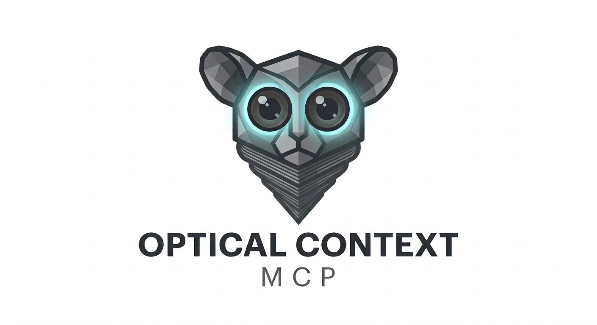
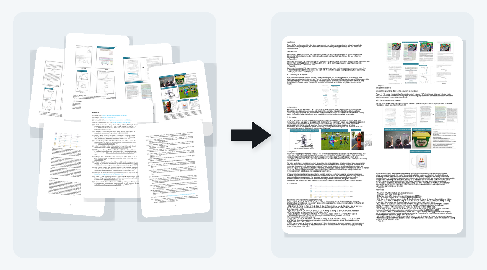
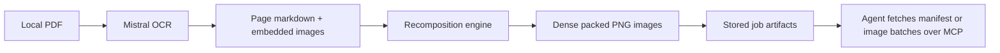

<!-- mcp-name: io.github.chrboebel/optical-context-mcp -->

<p align="center">
  
</p>

<h1 align="center">Optical Context MCP</h1>

<p align="center">
  FastMCP server for compressing large, OCR-heavy PDFs into dense packed images for agent workflows.
</p>

<p align="center">
  <a href="https://www.python.org/"></a>
  <a href="https://gofastmcp.com/"></a>
  <a href="https://github.com/ChrBoebel/optical-context-mcp/actions/workflows/ci.yml"></a>
  <a href="./LICENSE"></a>
</p>

Optical Context MCP is built for one specific problem: giving agents a practical way to work with **large, visually structured PDFs** without sending every page individually to a vision model.

It reads a local PDF, runs OCR with Mistral, recomposes the extracted text and figures into a much smaller set of packed images, and exposes those artifacts over MCP for batch retrieval.

## What It Does

- reads a local PDF from the MCP host machine
- extracts page markdown and embedded images with Mistral OCR
- packs that content into dense PNGs that preserve visual grouping
- stores a manifest and job artifacts for follow-up retrieval
- lets an agent pull only the packed images it needs

## Where It Fits

Use it for:

- operating manuals
- scanned handbooks
- product catalogs
- PDF slide decks
- visually structured OCR-heavy documents

Skip it for:

- tiny PDFs
- clean text-native PDFs where normal extraction is enough
- workflows that require exact page-faithful rendering
- cases where OCR cost is not justified

## Example Result

The image below shows a real local validation run on a public research paper with dense text, figures, charts, and page-level visual structure. The packed image on the right consolidates the seven source pages shown on the left.

<p align="center">
  
</p>

Example local run facts from the generated manifest:

- source paper pages: 22
- previewed source page range: 15 to 21
- extracted images: 30
- packed output images: 6
- example packed image size: `986x1084`
- example packed image file size: `536,697 bytes`

This example shows the intended workflow: take a long, visually structured PDF and compress it into a smaller set of retrievable packed images that still preserve the visual structure of the source.

## Install

```bash
python -m pip install "git+https://github.com/ChrBoebel/optical-context-mcp.git@v0.1.1"
```

Run directly from GitHub with `uvx`:

```bash
uvx --from git+https://github.com/ChrBoebel/optical-context-mcp@v0.1.1 optical-context-mcp
```

- `MISTRAL_API_KEY` is required for `compress_pdf`

## Run

Default transport is `stdio`:

```bash
optical-context-mcp
```

## Claude Code

Register the server in a project:

```bash
claude mcp add -s project optical-context -- uvx --from git+https://github.com/ChrBoebel/optical-context-mcp@v0.1.1 optical-context-mcp
```

Typical use:

1. call `compress_pdf`
2. inspect the returned manifest
3. fetch packed images with `get_packed_images`

## MCP Tools

- `compress_pdf`: run OCR plus recomposition and create a stored job
- `get_job_manifest`: load metadata for an existing job
- `get_packed_images`: fetch one or more packed PNGs from an existing job

## How It Works



## Why Packed Images Instead Of Just OCR Text

- section grouping
- table-like layout
- captions near figures
- visual adjacency between text and embedded graphics

For many vision-capable agents, that is a better intermediate format than a plain OCR dump.

## Current Scope

- depends on Mistral OCR
- currently handles local file paths, not remote uploads
- optimized for compression and retrieval, not final polished markdown generation
- quality depends on OCR quality and the visual density of the source document

## Roadmap

- make the OCR layer provider-agnostic so different OCR backends can be swapped behind the same MCP workflow

## Development

```bash
uv venv --python /opt/homebrew/bin/python3.11 .venv
uv pip install --python .venv/bin/python -e ".[dev]"
.venv/bin/python -m pytest
```
