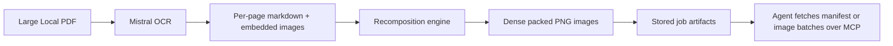

# Optical Context MCP

[](https://www.python.org/)
[](https://gofastmcp.com/)
[](./LICENSE)

FastMCP server for **large, OCR-heavy PDF workflows**. It reads a local PDF, runs OCR with Mistral, recomposes the content into a much smaller set of dense packed images, and returns those images to an MCP client in a form that agents can actually work with.

The main use case is simple: an agent should not have to open a 100-page PDF and send every page individually to a vision model when a compact visual representation is enough.

## Why This Exists

Large PDFs are expensive and awkward in agent workflows:

- page-by-page vision input explodes token usage
- OCR-heavy documents often contain mixed text, diagrams, tables, and embedded figures
- raw OCR text loses visual grouping that still matters for reasoning
- agents usually need iterative access, not one giant blob upfront

This server reduces that problem to:

`local PDF -> OCR -> dense packed PNGs -> batched retrieval over MCP`

## When To Use It

Use this MCP when an agent is working with **big documents that are visually structured**:

- corporate design manuals
- scanned handbooks and operating manuals
- product catalogs and brochures
- slide decks exported as PDF
- research appendices with mixed text and figures
- OCR-heavy archives where plain text extraction is not enough

It is especially useful when:

- the document is too large to send page-by-page to a model
- you want an MCP server to hold the heavy lifting outside the agent context
- the agent should pull packed images in batches instead of opening the entire source document
- you need reusable job artifacts for follow-up analysis

## When Not To Use It

This is not the best tool for every PDF:

- tiny documents with only a few pages
- digitally-native PDFs where direct text extraction is already clean
- workflows that require exact page-faithful reproduction
- cases where OCR cost is not justified

## What The MCP Does

The server currently focuses on one strong workflow:

1. Accept a local `pdf_path`
2. Run Mistral OCR on the source PDF
3. Extract page markdown and embedded images
4. Recompose that content into compact multi-page packed PNGs
5. Save a manifest and artifacts to a job directory
6. Return either a small inline preview or batch-fetchable packed images

It intentionally does **not** run a second LLM post-processing step yet. The MCP is optimized for **compression and retrieval**, not for final document rewriting.

## Architecture



## MCP Tools

### `compress_pdf`

Runs the full OCR + packing flow and creates a stored job.

Input:

- `pdf_path`
- `chars_per_image`
- `inline_images`

Returns:

- structured job metadata
- optional inline image preview
- persisted artifacts on disk for follow-up retrieval

### `get_job_manifest`

Loads the saved manifest for an existing job.

Use this when the agent needs:

- page count
- packed image count
- output directory
- artifact paths

### `get_packed_images`

Returns one or more packed PNGs from an existing job.

Use this when the agent should inspect the compressed document incrementally instead of loading everything at once.

## Typical Agent Workflow

For a large corporate design guide or manual:

1. Agent calls `compress_pdf`
2. MCP creates a job and returns metadata plus a small preview
3. Agent checks `packed_image_count`
4. Agent pulls more packed images with `get_packed_images`
5. Agent reasons over the compressed image set instead of the full original PDF

This keeps the expensive document preprocessing outside the conversational context while still making the result accessible on demand.

## Repository Layout

```text
.
├── server.py
├── pyproject.toml
├── README.md
├── LICENSE
├── jobs/                  # generated at runtime, ignored by git
├── optical_mcp/
│   ├── __init__.py
│   ├── mistral_client.py
│   ├── models.py
│   ├── recomposition.py
│   ├── service.py
│   └── storage.py
└── tests/
```

## Setup

```bash
uv venv --python /opt/homebrew/bin/python3.14 .venv
uv pip install --python .venv/bin/python -e .
```

Environment:

- `MISTRAL_API_KEY` is required

You can provide it via shell environment or a local `.env` file in the repository root.

## Run

Default MCP transport is `stdio`:

```bash
.venv/bin/python server.py
```

## Claude Code Example

Project-local registration:

```bash
claude mcp add -s project optical-context -- /absolute/path/to/.venv/bin/python /absolute/path/to/server.py
```

Then an agent can do things like:

- compress a large PDF once
- inspect the manifest
- fetch packed images in batches

## Job Artifacts

Each run creates a directory under `jobs/<job_id>/` with:

- `manifest.json`
- `ocr_markdown.md`
- `packed_001.png`, `packed_002.png`, ...

Example manifest fields:

- `job_id`
- `source_pdf`
- `page_count`
- `extracted_image_count`
- `packed_image_count`
- `packed_images`

## Why Packed Images Instead Of Just OCR Text

Pure OCR text is often not enough for large visual documents. Packed images preserve:

- section grouping
- table-like layout
- captions near figures
- visual adjacency between text and embedded graphics

That makes them a better intermediate format for many vision-capable agents.

## Current Limits

- depends on Mistral OCR
- currently handles local file paths, not remote uploads
- optimized for compression and retrieval, not final polished markdown generation
- quality depends on OCR quality and the visual density of the source document

## Development

Run tests:

```bash
.venv/bin/python -m pytest
```

## Roadmap

- optional HTTP transport configuration
- richer client examples for Claude Code and other MCP hosts
- configurable recomposition presets for different document types
- optional second-stage reasoning or extraction pipeline on top of packed images
